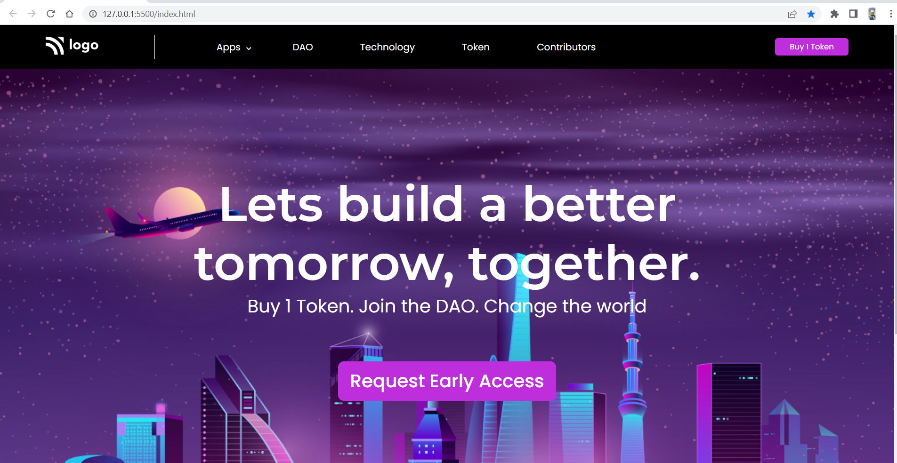

# Project 5: Crypto Landing page

   

### Name:

> `Anshul Ghogre`

## Key Learnings from the project

- _Learned how to utilise full height of a background image_
- _Explored transform properties from MDN Docs_

---

### Screenshots:-

---

> Time taken to complete this project: 4hrs

---

## [Live-Link](https://project-5-crypto-landing-page.netlify.app//)

---
